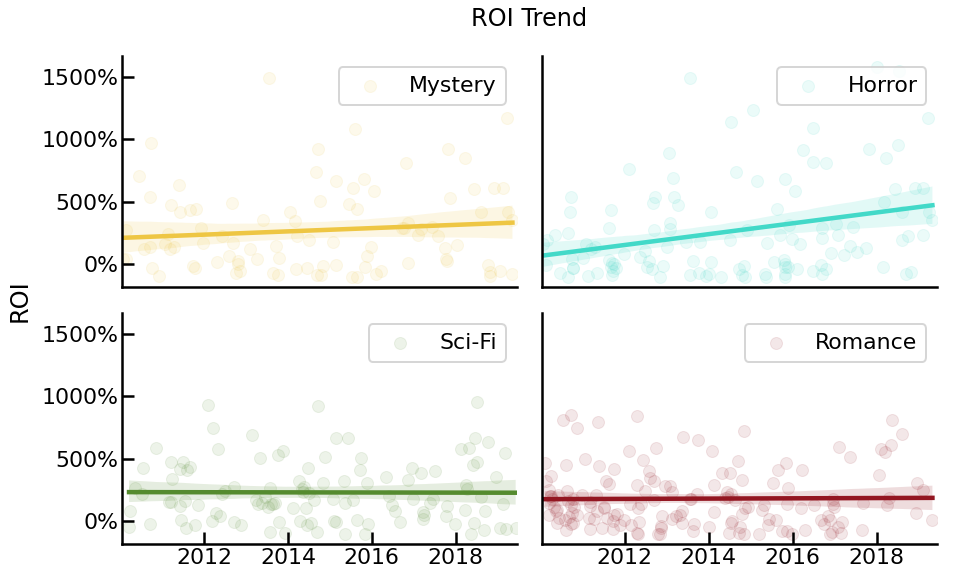
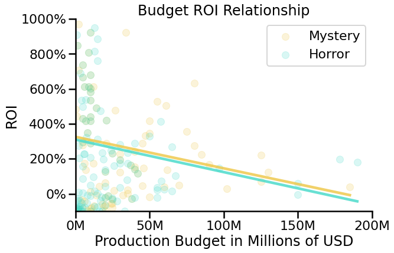

<span style="float:right">Photo by <a href="https://unsplash.com/@dmjdenise?utm_source=unsplash&amp;utm_medium=referral&amp;utm_content=creditCopyText">Denise Jans</a> on <a href="https://unsplash.com/s/photos/movie?utm_source=unsplash&amp;utm_medium=referral&amp;utm_content=creditCopyText">Unsplash</a></span>

<h1>Table of Contents<span class="tocSkip"></span></h1>
<div class="toc"><ul class="toc-item"><li><span><a href="#Breaking-into-the-movie-industry" data-toc-modified-id="Breaking-into-the-movie-industry-1"><span class="toc-item-num">1&nbsp;&nbsp;</span>Breaking into the movie industry</a></span><ul class="toc-item"><li><span><a href="#Overview" data-toc-modified-id="Overview-1.1"><span class="toc-item-num">1.1&nbsp;&nbsp;</span>Overview</a></span></li><li><span><a href="#Business-Problem" data-toc-modified-id="Business-Problem-1.2"><span class="toc-item-num">1.2&nbsp;&nbsp;</span>Business Problem</a></span></li><li><span><a href="#Data" data-toc-modified-id="Data-1.3"><span class="toc-item-num">1.3&nbsp;&nbsp;</span>Data</a></span></li></ul></li><li><span><a href="#Questions-and-Methods" data-toc-modified-id="Questions-and-Methods-2"><span class="toc-item-num">2&nbsp;&nbsp;</span>Questions and Methods</a></span><ul class="toc-item"><li><span><a href="#Clean-Data" data-toc-modified-id="Clean-Data-2.1"><span class="toc-item-num">2.1&nbsp;&nbsp;</span>Clean Data</a></span><ul class="toc-item"><li><span><a href="#Clean-the-movie-budget-dataframe." data-toc-modified-id="Clean-the-movie-budget-dataframe.-2.1.1"><span class="toc-item-num">2.1.1&nbsp;&nbsp;</span>Clean the movie budget dataframe.</a></span></li><li><span><a href="#Clean-up-imdb_title_principals" data-toc-modified-id="Clean-up-imdb_title_principals-2.1.2"><span class="toc-item-num">2.1.2&nbsp;&nbsp;</span>Clean up imdb_title_principals</a></span></li><li><span><a href="#Clean-up-imdb_name_basics" data-toc-modified-id="Clean-up-imdb_name_basics-2.1.3"><span class="toc-item-num">2.1.3&nbsp;&nbsp;</span>Clean up imdb_name_basics</a></span></li><li><span><a href="#Clean-up-imdb_title_basics" data-toc-modified-id="Clean-up-imdb_title_basics-2.1.4"><span class="toc-item-num">2.1.4&nbsp;&nbsp;</span>Clean up imdb_title_basics</a></span></li></ul></li><li><span><a href="#Join-the-data" data-toc-modified-id="Join-the-data-2.2"><span class="toc-item-num">2.2&nbsp;&nbsp;</span>Join the data</a></span><ul class="toc-item"><li><span><a href="#Join-title_basics-and-movie_budget-as-df" data-toc-modified-id="Join-title_basics-and-movie_budget-as-df-2.2.1"><span class="toc-item-num">2.2.1&nbsp;&nbsp;</span>Join title_basics and movie_budget as df</a></span></li><li><span><a href="#Join-df-with-title_principals-as-df" data-toc-modified-id="Join-df-with-title_principals-as-df-2.2.2"><span class="toc-item-num">2.2.2&nbsp;&nbsp;</span>Join df with title_principals as df</a></span></li><li><span><a href="#Join-df-with-name_basics-as-df" data-toc-modified-id="Join-df-with-name_basics-as-df-2.2.3"><span class="toc-item-num">2.2.3&nbsp;&nbsp;</span>Join df with name_basics as df</a></span></li></ul></li><li><span><a href="#Remove-Outliers" data-toc-modified-id="Remove-Outliers-2.3"><span class="toc-item-num">2.3&nbsp;&nbsp;</span>Remove Outliers</a></span><ul class="toc-item"><li><span><a href="#Overall-with-zcore" data-toc-modified-id="Overall-with-zcore-2.3.1"><span class="toc-item-num">2.3.1&nbsp;&nbsp;</span>Overall with zcore</a></span></li><li><span><a href="#By-Genre-with-Q3-+-(1.5*IRQ)" data-toc-modified-id="By-Genre-with-Q3-+-(1.5*IRQ)-2.3.2"><span class="toc-item-num">2.3.2&nbsp;&nbsp;</span>By Genre with Q3 + (1.5*IRQ)</a></span></li></ul></li></ul></li><li><span><a href="#Questions" data-toc-modified-id="Questions-3"><span class="toc-item-num">3&nbsp;&nbsp;</span>Questions</a></span><ul class="toc-item"><li><span><a href="#Q1:-Which-Genres-are-the-most-profitable" data-toc-modified-id="Q1:-Which-Genres-are-the-most-profitable-3.1"><span class="toc-item-num">3.1&nbsp;&nbsp;</span>Q1: Which Genres are the most profitable</a></span><ul class="toc-item"><li><span><a href="#Conclusion" data-toc-modified-id="Conclusion-3.1.1"><span class="toc-item-num">3.1.1&nbsp;&nbsp;</span>Conclusion</a></span></li></ul></li><li><span><a href="#Q2:-What-is-the-ideal-budget-for-the-film" data-toc-modified-id="Q2:-What-is-the-ideal-budget-for-the-film-3.2"><span class="toc-item-num">3.2&nbsp;&nbsp;</span>Q2: What is the ideal budget for the film</a></span><ul class="toc-item"><li><span><a href="#Create-Budget-Class-Feature" data-toc-modified-id="Create-Budget-Class-Feature-3.2.1"><span class="toc-item-num">3.2.1&nbsp;&nbsp;</span>Create Budget Class Feature</a></span></li><li><span><a href="#Conclusion" data-toc-modified-id="Conclusion-3.2.2"><span class="toc-item-num">3.2.2&nbsp;&nbsp;</span>Conclusion</a></span></li></ul></li><li><span><a href="#Q3-Who-are-the-most-profitable-people?" data-toc-modified-id="Q3-Who-are-the-most-profitable-people?-3.3"><span class="toc-item-num">3.3&nbsp;&nbsp;</span>Q3 Who are the most profitable people?</a></span><ul class="toc-item"><li><span><a href="#Create-features" data-toc-modified-id="Create-features-3.3.1"><span class="toc-item-num">3.3.1&nbsp;&nbsp;</span>Create features</a></span></li><li><span><a href="#Filter-our-Working-data" data-toc-modified-id="Filter-our-Working-data-3.3.2"><span class="toc-item-num">3.3.2&nbsp;&nbsp;</span>Filter our Working data</a></span></li><li><span><a href="#Explore-the-data" data-toc-modified-id="Explore-the-data-3.3.3"><span class="toc-item-num">3.3.3&nbsp;&nbsp;</span>Explore the data</a></span></li><li><span><a href="#Create-visualizations-for-various-movie-industry-roles" data-toc-modified-id="Create-visualizations-for-various-movie-industry-roles-3.3.4"><span class="toc-item-num">3.3.4&nbsp;&nbsp;</span>Create visualizations for various movie industry roles</a></span></li></ul></li></ul></li><li><span><a href="#Evaluation" data-toc-modified-id="Evaluation-4"><span class="toc-item-num">4&nbsp;&nbsp;</span>Evaluation</a></span></li><li><span><a href="#Conclusions" data-toc-modified-id="Conclusions-5"><span class="toc-item-num">5&nbsp;&nbsp;</span>Conclusions</a></span><ul class="toc-item"><li><span><a href="#What-could-be-improved" data-toc-modified-id="What-could-be-improved-5.1"><span class="toc-item-num">5.1&nbsp;&nbsp;</span>What could be improved</a></span></li><li><span><a href="#The-next-steps" data-toc-modified-id="The-next-steps-5.2"><span class="toc-item-num">5.2&nbsp;&nbsp;</span>The next steps</a></span></li></ul></li><li><span><a href="#For-More-Information" data-toc-modified-id="For-More-Information-6"><span class="toc-item-num">6&nbsp;&nbsp;</span>For More Information</a></span></li></ul></div>

# Breaking into the movie industry
Author: Ben Bogart

## Overview
This is a case study for Microsoft, which has decided to open a new movie studio.  Microsoft needs to make make key decisions about the initial steps of creating their first movie including setting a budget, choosing which genres to focus on, and choosing whom to work with.  The data provided comes from IMDB, Box Office Mojo, Roten Tomatoes, The Movie Database, and TheNumbers.com.  The methodology includes joining, filtering, and visualizing the data to illustrate trends primarily related to ROI. The results show that Microsoft should focus on Horror and/or Mystery, spend between $6M - $14.2M, and look to partner with a short list of producers, writers, and actors listed at the end of question 3. 

## Business Problem
Microsoft has decided to open a movie studio.  At this point they are at the beginning of their journey to understand the movie industry. They need information to make high level decisions that will increase their likelihood of success.  Success is defined as a profitable investment that allows for the creation of future movies and a long term acquisition of industry experience.  Making an incorrect decision about budget or how to spend money could lead to failure which would be both embarrassing for the company and result in a loss of money.

This problem led to the the following three high level questions, which were chosen as they represent actionable first steps for breaking into the movie industry.
* Which genres yield the highest ROI
* What budget range in those genres yields the highest ROI
* Who should Microsoft reach out to in the movie industry for partnerships

## Data

The following data tables were used to answer the questions investigated here. The data comes from IMDB and the-numbers.com:
* tn_movie_budgets
* imdb_title_principals
* imdb_title_basics
* imdb_name_basics

`tn_movie_budgets` contains movie budgets and gross income figures by movie and year.
`imdb_title_principals` contains keys for connection people to films and the role they held.
`imdb_title_basics` contains title, release year, and genre.
`imdb_name_basics` contains information about individuals.  We are just using their name.

Because there is no key in common the tables have to be joined on release year and title, and errors in that process need to be evaluated.

The data is stored in the data/zippedData directory of this repo.
    
Some of the code, including a data loader, has been consolidated into the included data_helpers package.

# Questions and Methods

Describe the process for analyzing or modeling the data. For Phase 1, this will be descriptive analysis.

Questions to consider:

How did you prepare, analyze or model the data?
Why is this approach appropriate given the data and the business problem?

## Clean Data
### Clean the movie budget dataframe.
The function `clean_tn_movie_budgets` takes in the raw `tn_movie_budgets` DataFrame and does the following:
1. Converts the `release_date` column to datetime
1. Converts UDS amounts to int
1. Adds a `release _year` column for joining
1. Removes rows where production budgets or worldwide gross == 0
1. Creates features for `ROI` and `ROI_zscore`

### Clean up imdb_title_principals

1. Drop columns we don't need 
1. Check for missing values
1. Combine Actor and Actress because its the same job. (and who says Actress anymore??)

### Clean up imdb_name_basics

Most of this data is truncated.  We have more complete data elsewhere.  Drop all columns except key and person's name

### Clean up imdb_title_basics

This table contains column with a comma separated list of genres.  Not all rows have genre information.  We drop the rows missing genre information and convert the rest to a list so they can later be exploded and used for grouping.

## Join the data

### Join title_basics and movie_budget as df
We will start by joining the title_basics and movie_budget so we can deal with any duplicates created by that join right away.

We will use merge to combine title_basics with movie_budgets using a right join on both release year, and movie title because we don't have a key in common.  Merge reindexes, so we reset the index to keep `tconst` in our table.

We know there are duplicates because titles are listed with the same release year
but different genres and `tconst` values in the `title_basics` DataFrame.  We will drop duplicates.

Since we don't know which of the duplicated movies is correct we will drop 
them all.  If we don't we could end up identifying the wrong people as profitable
which would be worse than not identifying a profitable person.

### Join df with title_principals as df
There is a unique key `tconst` for joining this title_principals with df.  This will give us movie
data for each principal in a movie.  The indices are already set so they don't need to be specified.

We want records for which we have data in both dataframes so we will use an inner join.

### Join df with name_basics as df

Because name_basics is just a Series, to join df with name_basics we just use map to create a new series from the nconst column.

Once the data is merged, we reset the index so we don't have to do that for every groupby.


## Remove Outliers

First we will visualize our data to see if it looks like there are outliers.  Then we will begin removing outliers.

Our first task will be to create a reusable function to visualize our data.

Our starting point looks like this:


### Overall with zcore
First we will remove all outliers with regard to movie budget using the zscore method (removing everything more than 3 std from the mean).

We create a zcore feature using the scipy.stats package and use it to limit our results.  We do not need to remove any outliers below 3 std below the mean because ROI below -100% is not possible.


### By Genre with Q3 + (1.5*IRQ)
This is better, but it looks like there are still quite a few outliers.  Perhaps comapring outliers for all movies is too broad.  Lets remove outliers with the Q3 + (1.5\*IRQ) method **for each genre** .  Again we do not need to remove any outliers below Q1 - (1.5\*IQR) because ROI below -100% is not possible.


Now the data is prepped for answering our questions.

# Questions
## Q1 Which Genres are the most profitable?

Our dataframe right now has movies appearing more than once per genre because it has a row for each role in the movie. For this question we need to make sure there is only one of each movie per genre.  It is ok for movies in multiple genres to appear in each of those genres once.

We also limit our data to genres containing more than 90 movies.  (90 was chose based evidence of sufficient data in visualizations).

In order to show the top performing genres, we group by genre to get the ROI by genre and visualize the top performing genres.


Limiting our exploration to only the top 4 genres we look at ROI trends overtime.



### Conclusion
Of the top four genres, one shows an obvioius upward trend in ROI.  Sci-Fi and Romance appear flat.  **Horror, Mystery** are not only the top earners by ROI, but the are both trending up.  These are the idea genres to focus on or a first film.

## Q2 What is the ideal budget for the film?

Limiting our search to Mustery and Horror, we look to see if there is a correlation between production budget and ROI across all categores.




The ROI is negativly correlated with Budget for these categories.

### Create Budget Class Feature

Does budget threshold change the ROI distribution?  We could build a a feature and see which does best for ROI.


Here are the thresholds for the various unions:
    
    The DGA and SAG thresholds for low budget are similar: $2.6 and $2.5 million respectively. The writer’s guild draws the line way down at $1.2 million.

    IATSE (the union that covers most of the below-the-line crew) has three different tiers: below $6 million, between $6 and $10 million, and $10 to $14.2 million. (Anything above that is full union rates.) To give you a sense of scale, Get Out only cost $4.5 million. Then again, not paying the crew full union wages and benefits is probably how Blumhouse keep their films profitable.
    
Source: http://www.anonymousproductionassistant.com/2018/01/17/low-budget-movie/

We will use the IATSE budget size thresholds because they better fit the budgets in our data.  To do this we create a function and use apply to create a new feature called `budget_class`.  We then create a box plot to show the distribution in those ranges. 

There were only 3 movies in the < \$6M class so we dropped that due to lack of data.


### Conclusion
In all cases the ideal budget is in the \$6M - \$14.2M range.  Over \$14.2M results in signifigant decrease in ROI.

## Q3 Who are the most profitable people?
We want to filter people by
* Budgets of films they have worked on
* People who have lost money on a film
* People who have made at least a certain number of films in our target genres (Horror and Mystery)

We want to show the range of an individual's ROIs on films so we don't want to take an average.  Instead we need to keep all the rows and deal with grouping durring visualization.

### Create features

We will create the features we need to do our filtering including:
* Create a `min_budget` feature for the lowest budget film each person has worked on
* Create a `mean_roi` feature for the mean of all the film budgets a person has worked on
* Create a `min_roi` feature for the lowest ROI of all the films a person has worked on
* create a `mean_cat_roi` feature for the mean roi for each person by the role the played in the movie

We want a mean ROI for each individual limited to their films in the Horror and Mystery categories.  To do this we will first limit our data to films in Horror and Mystery and remove any duplicate movies (movies that appear in both categories).  Then we will use transform because it applies an aggregation function but along the original axis keeping the original index.  And we will fill any na with 0 so it doesn't cause problems later.

* create a `mean_hm_roi` feature for the mean ROI of horror and mystery films a person has worked on 

We want to create a feature for the number of horror or mystery films a person has been so we can later exclude people who have made fewer than a certain number of films in these categories.  To do this we first limit our data to those categories, then group by person, and count the number of unique film ids *tconst* in each group.  Because the resulting Series does not have the same index we use map to lookup the values for our num_hm_films column.

* create a `mean_hm_films` feature for the number of films a person has been in by genre

### Filter our Working data

We now use the features we have created to narrow down our results to only the people that meat our criteria.
* remove people who have never worked on a film with a budget under 14.2M
* remove people who have lost money on a film
* remove people who have only been in one Horror or Mystery Film


### Explore the data

Start looking at who the most profitable people are in Horror and Mystery Movies.  Add their movie role under their name.


We need to limit our results to certain roles in the movie industry because we don't have time to present them all.  Let's find out which categories have the highest number people in them and work with those. Can we determine which roles are most profitable?


That is uniformative.  Perhaps because every movie needs all of these people so their distributions are the similar.  We will look at the roles (categories) individually.

### Create visualizations for various movie industry roles

Start by creating a plotting function that can be passed different roles (category), and can take care of limiting and sorting the data.

One challenge is limiting to a specific number of individuals because each individual is listed multiple times in the data.  To take care of this we create an `nconsts` series with the sorted individuals and we filter our dataframe comparing to a slice of `nconsts`.

    #create a list of individuals so we can limit to a number of individuals
    nconsts = df['nconst'].unique()
    
    #limit to number of people
    df = df[df['nconst'].isin(nconsts[:num])]

We will limit our search to producers because producers are responsible for hiring directors have have a hand in the entire moving making process.


# Evaluation

The data here clearly suggests that Horror and Mystery films are moderate budget and high ROI genres. These would be a good choice for a first movie.  Because of the limited data it is not clear that these would be the **best** choice.  I had to remove genres like Animation because I didn't data have enough films that met our criteria for inclusion in the analysis.  Also, if Microsoft plans to spend more than /$14.2M other categories would be a better fit. 

It is important to note that in all genres there were films that lost money, and the ROI varied greatly by film.  While the choices laid out here will increase the likelihood of success, it does not indicate that similar results would be expected from only the above recommendations.   There are many other factors to explore, and quite a bit of creativity to inspire in order to get the best results.  

# Conclusions

Based on the data availabe my recomendation is for Microsfot to spend \$6M - \$14.2 on a Horror/Mystery movie with 
one of the following producers: 
* James Wan
* Sébastien K. Lemercier
* Peter Safran
* Brad Fuller
* Marty Bowen
* Michael Bay
* Andrew Form
* Roxanne Avent


## What could be improved
Several genres had to be dropped from the analysis because too few films met our criteria.  Acquiring more data and rerunning the above analysis would be beneficial and increase confidence in the results.

## The next steps
To continue this line of investigation:
* It is assumed here that producers have the highest impact on a movies success because they hire the director and have final say on casting, but further exploration should be done to verify this.
* Look at pairings of people to see if there are teams that are more profitable.
* Look at the percentage of profitable films by genre
* Investigate the budget distributions for genres like Sci-Fi and Animation to see if similar conclusions can be made about them on a different scale.

Areas to investigate outside this line:
* Explore effects of runtime on profitability by genre
* Explore whether production studio has an impact on ROI
* Explore whether the Rating affects the ROI, and if so what can be done to influence the rating.

# For More Information
Please review our full analysis in our [Jupyter Notebook](Movie_Data_Analysis.ipynb) or our [Presentation](Presentation.pdf).

For any additional questions, please contact Ben Bogart / ben@benbogart.com

Repository Structure
```
.
├── Movie_Data_Analysis.ipynb           <- the main notebook for the project
├── data                                <- data the project is based on
├── data_helpers                        <- a project specific package for getting and manipulating data
├── images                              <- images used throughout the project
├── presentation.pdf                    <- PDF version of project presentation
└── readme.md                           <- The top-level README for reviewers of this project
```


```python

```
